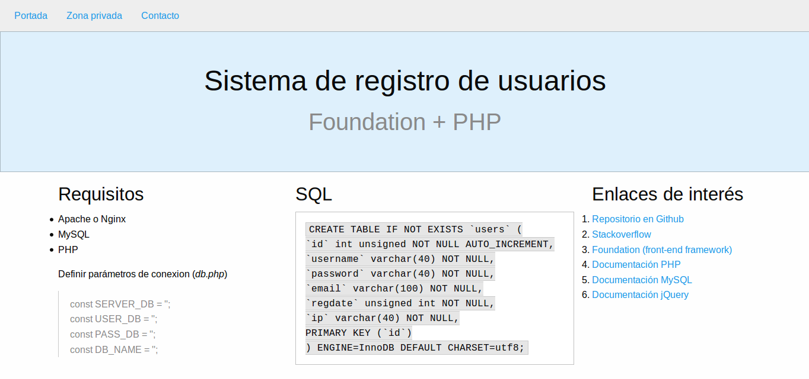

# Tutorial PHP

Versión mejorada del tutorial realizado para [FP Informática](http://www.fp-informatica.es/tutorial-registro-usuarios-php/). En este caso se ha desarrollado una pequeña web modular usando la metodología orientada a objetos.

Además se usa la extensión mysqli para la conexión y se han declarado métodos para mejorar la seguridad como **genHash()**.

Vista previa:


## Diseño Responsive

Para este proyecto se ha optado por un diseño sencillo y adaptable a la mayoría de los dispositivos. Para conseguirlo se ha usado [Foundation](https://github.com/zurb/foundation-sites), uno de los frameworks CSS más conocidos.

## Requisitos

* Apache o Nginx
* MySQL
* PHP

Para los usuarios que se están iniciando en este mundillo recomiendo los [paquetes de software](https://en.wikipedia.org/wiki/List_of_AMP_packages) que ya integran estas tres herramientas.

Si hay dudas a la hora de elegir uno de estos, recomiendo [XAMPP](https://www.apachefriends.org).

## Instalación

Suponiendo que ya hemos creado una base de datos para este propósito necesitamos crear la tabla de usuarios, en caso de usar phpMyAdmin podemos ejecutar la siguiente sentencia SQL:

```
CREATE TABLE IF NOT EXISTS `users` (
`id` int unsigned NOT NULL AUTO_INCREMENT,
`username` varchar(40) NOT NULL,
`password` varchar(40) NOT NULL,
`email` varchar(100) NOT NULL,
`regdate` unsigned int NOT NULL,
`ip` varchar(40) NOT NULL,
PRIMARY KEY (`id`)
) ENGINE=InnoDB DEFAULT CHARSET=utf8;
```

Definir parámetros de conexion (include/db.php)

```
const SERVER_DB = '';
const USER_DB   = '';
const PASS_DB   = '';
const DB_NAME   = '';
```

[Descargar los ficheros](https://github.com/jslirola/tutorial-php/archive/master.zip) del repositorio en un directorio que reconozca vuestro servidor web, por ejemplo:

* /var/www/html/tutorial-php
* C:\Program Files\Apache2\htdocs\tutorial-php

Por último (con el servidor iniciado) abrir en un navegador web la dirección que corresponda con el directorio, en mi caso:

http://localhost/tutorial-php/

Pulsando en el menú superior sobre el enlace "Zona privada" se mostrarán dos formularios para realizar el alta de usuarios y su identificación.

## Change Log

* v1.0: Alta e identificación de usuarios (Zona privada)

## Contribuir

Si quieres colaborar con el proyecto puedes abrir una [issue](https://github.com/jslirola/tutorial-php/issues/new) o enviar una [PR](https://github.com/jslirola/tutorial-php/pulls) si has programado algo.